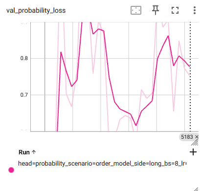
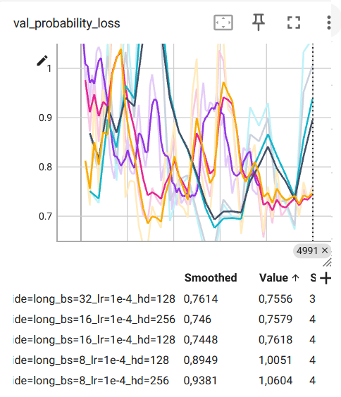
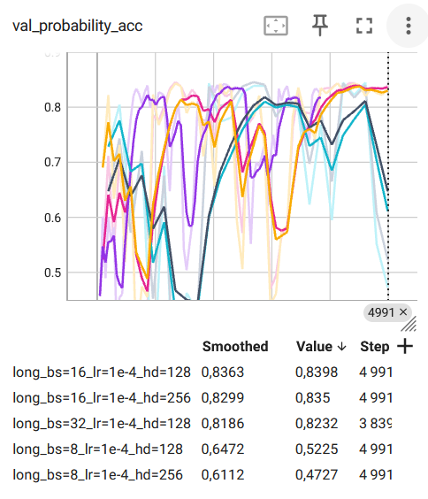

# Probability Head Training

The probability head was started with:

```bash
HEAD_TYPE=probability
SCENARIO=order_model
TRADE_SIDE=long
TRAIN_SAMPLES_PER_EPOCH=3072
VAL_SAMPLES=1024
MAX_STEPS=20000
PNL_MARGIN=1000
```

`PNL_MARGIN=1000` is used to ignore near-zero raw PnL examples when training the probability head. Concretely, samples with `abs(pnl) <= 1000` are discarded for the probability loss, so the model focuses on clearer positive/negative cases.

Even with this margin filter, the results are still not good.

For the previous 2-class probability head, a validation loss around `0.6` meant the binary cross-entropy was below the naive `~0.69` baseline, so the model was learning something, but the result was still not especially strong.



For the newer 3-class probability head, the loss is `CrossEntropyLoss` on 3 logits:
- class `0`: unprofitable, `pnl < -PNL_MARGIN`
- class `1`: unclear, `-PNL_MARGIN <= pnl <= PNL_MARGIN`
- class `2`: profitable, `pnl > PNL_MARGIN`

The validation loss looks more stable, and the validation accuracy is also fairly high, which suggests the 3-class formulation is easier to learn than the previous binary setup:

<p>
  
  
</p>

The hypersearch was not finished because it had to be stopped early.

Possible next ideas:
- unfreeze the last MarS transformer block after a short warmup, so the backbone can adapt a bit to the trading target
- keep the 3-class head, but calibrate the final probabilities afterward with temperature scaling or isotonic regression

## Training perfs per configuration

For seed `44` with threshold `100` (`PNL_MARGIN=100`), the sampled probability-class balance was:

```text
train probability-class balance over 512 samples
train unprofitable=320 (0.625000)
train unclear=32 (0.062500)
train profitable=160 (0.312500)

val probability-class balance over 256 samples
val unprofitable=177 (0.691406)
val unclear=15 (0.058594)
val profitable=64 (0.250000)
```

The following table shows the best probability accuracy over each run:

|  | small threshold: 100 | big threshold: 1000 |
| --- | --- | --- |
| order_model | - | - |
| order_batch | - | - |
| both | - | - |
