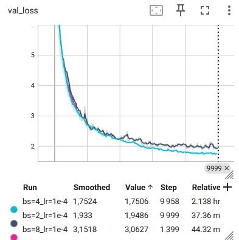

# Training 

stocks: AAPL, AMD, AVGO, META, NFLX

Training set: 3-11-2025 -> 10-11-2025

Eval set: 17-11-2025 -> 19-11-2025


## Data

Each sample ends at a valid anchor time, i.e. a timestamp with enough history to build the previous 16 one-minute order images. These 16 images are converted into discrete VQ tokens with the best trained VQGAN checkpoint, i.e. the one with validation reconstruction loss `0.031307`.


## Train data sampling

Sampling is close in spirit to the `Order Model` sampler, but not identical.

For each file, the code first keeps only valid anchor times during market hours, then:

- groups anchor times into 15-minute sampler blocks (this is only for sampling; each sample still contains 16 minutes of history)
- inside each block, keeps anchors at least 30 seconds apart
- splits the selected anchors into chunks (size `128` in the sweep)
- shuffles the chunks
- shuffles anchors again inside each chunk

Training iterates over all selected anchors each pass (`drop_last=True`).


## Eval data sampling

Validation uses the same temporal-spacing + chunk-shuffle logic as training, with the same fixed seed, so it is deterministic. In the sweep, validation used chunk size `128`, kept the last partial batch (`drop_last=False`), and evaluated only `20 * batch_size` sampled anchors.


## Hyperparameter search

```bash
LRS=(1e-4 3e-4)
BSS=(2 4 8)
```

Best curve in this sweep: `bs=4, lr=1e-4` (`val_loss ~= 1.70`). 

<p align="center">
  
</p>

The `bs=8, lr=1e-4` stopped much earlier, so the **search should be continued !**
