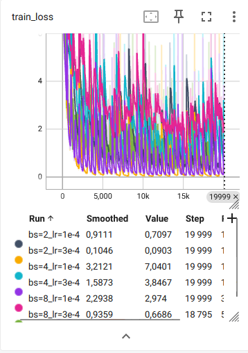
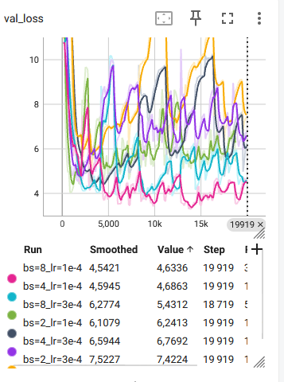

# Training 

stocks: AAPL, AMD, AVGO, META, NFLX

Training set: 3-11-2025 -> 10-11-2025

Eval set: 17-11-2025 -> 19-11-2025

## Train data sampling

Each training sample is a sliding window of length `K` taken from one `*_messages.parquet` file after filtering to market hours only (`09:30` to `16:00`).

For one file with `N` valid rows, the dataset creates:

`N - K + 1`](image.png)

possible windows, with stride `1`.

So if `K = 1024`, sample `i` from a file is:

- rows `[i : i + 1024]`

This means consecutive samples overlap heavily.

During training, the code does not iterate through all windows in plain file order. Instead, it uses a custom sampler:

1. For each file, all its windows are split into chunks of size `train_chunk_size` (default: `2048` windows).
2. All chunks from all files are mixed together.
3. The sampler shuffles the order of the chunks.
4. Inside each selected chunk, it shuffles the windows again.
5. It keeps yielding windows until `train_num_samples` windows have been produced.

So the training order is:

- random across chunks
- random inside each chunk
- without replacement inside one sampler pass
- limited to `train_num_samples` if this argument is set

## Eval data sampling

Validation samples are built from the validation `*_messages.parquet` files in the same way as training samples:

- each sample is a sliding window of length `K`
- for one file with `N` valid rows, this gives `N - K + 1` possible windows
- sample `i` corresponds to rows `[i : i + K]`

Validation uses the same `ChunkShuffleBatchSampler` as training, but with validation-specific settings.

The validation sampler:

- splits validation windows into chunks
- shuffles the chunks with a fixed seed
- shuffles the windows inside each chunk
- stops after `val_num_samples` windows
- keeps the last partial batch if needed (`drop_last=False`)

So validation sampling is deterministic by default:

- same seed
- same sampled subset
- same order at every validation check

By default, if `val_num_samples` is not set, validation uses `10 * batch_size` windows.

## Results

  
  &nbsp;&nbsp;&nbsp;&nbsp;
  

Very short takeaways:

- `bs=8, lr=1e-4` reaches the best validation loss on these runs (`3.2856`), with `bs=4, lr=1e-4` close behind (`3.7609`).
- Training loss decreases well for the smaller learning rates, but validation remains relatively high and noisy, which suggests limited generalization so far.
- TensorBoard typically shows the last selected value on the curve, not the best value reached during training.
- To improve: run longer sweeps around `lr=1e-4`, try a bit more regularization, and evaluate on a larger / more diverse validation period.
