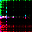
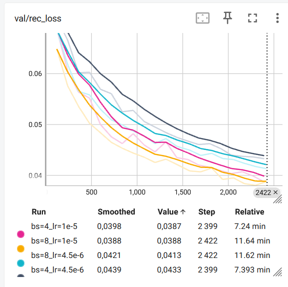

# VQGAN Training

This folder contains a simple "stage-1" VQGAN fine-tuning setup for MarS-style order images.

The main script is [`train_vqgan_hypersearch.py`](/home/random/projects/MarS/custom_code/training/vqgan/train_vqgan_hypersearch.py).
It does not read precomputed zarr order images. Instead, it:

- reads raw `*_messages.parquet` files
- pairs them with matching `*_snapshots.parquet` files
- converts each one-minute order batch into one RGB order image of shape `(3, 32, 32)`
- normalizes images to `[-1, 1]`
- fine-tunes the local LDM `vq-f4` VQ model

This matches the MarS stage-1 idea more closely than the older notebook code.


## Training samples

Each dataset sample is one single one-minute order image.

This is intentionally different from the 16-image history used later for the Order Batch Model.
The VQGAN here is only trained as an image tokenizer over individual order-batch images.


## Pretrained initialization

By default, the script can fine-tune from a pretrained VQ checkpoint through:

`--init_ckpt /path/to/pretrained_vq.ckpt`

If `--init_ckpt` is omitted, the model is initialized from the local `vq-f4` config and trained from scratch.

Official pretrained `vq-f4` weights can be obtained from the CompVis latent-diffusion model zoo:

- model zoo page: https://github.com/CompVis/latent-diffusion?tab=readme-ov-file#model-zoo
- direct archive: https://ommer-lab.com/files/latent-diffusion/vq-f4.zip

After downloading and extracting `vq-f4.zip`, point `--init_ckpt` to the extracted checkpoint file.

The architecture config used by default is:

`third_party/latent_diffusion/models/first_stage_models/vq-f4/config.yaml`

This is the standard LDM VQ setup used here as the MarS-style image tokenizer backbone:

- codebook size `8192`
- embedding dimension `3`
- downsampling factor `f=4`

So a `32x32` order image maps to an `8x8` latent grid, i.e. `64` discrete tokens.


## Local run

Example single run:

```bash
cd /home/random/projects/MarS

python custom_code/training/vqgan/train_vqgan_hypersearch.py \
  --train_dir data/train \
  --val_dir data/val \
  --converter_json_path custom_code/preprocessing/converters_portable.json \
  --vq_config third_party/latent_diffusion/models/first_stage_models/vq-f4/config.yaml \
  --init_ckpt /path/to/pretrained_vq.ckpt \
  --batch_size 16 \
  --lr 4.5e-6 \
  --max_steps 20000 \
  --num_workers 2 \
  --run_root mars_runs/vqgan \
  --run_name bs=16_lr=4.5e-6
```


## Hyperparameter sweep

The local sweep script is:

[`run_vqgan_local.sh`](/home/random/projects/MarS/custom_code/training/vqgan/run_vqgan_local.sh)

Usage:

```bash
cd /home/random/projects/MarS/custom_code/training/vqgan

INIT_CKPT=/path/to/pretrained_vq.ckpt bash run_vqgan_local.sh
```

If `INIT_CKPT` is empty, the sweep runs from random initialization.


## Outputs

Runs are written under:

- TensorBoard and checkpoints: `mars_runs/vqgan/tensorboard/<run_name>/`
- stdout/stderr logs: `custom_code/training/vqgan/logs/`

The checkpoint callback monitors:

`val/rec_loss`

and keeps the best checkpoint for each run.


## Results

Example reconstruction comparison:

| Original | Reconstruction |
| --- | --- |
|  |  |

Validation reconstruction loss during training:



The validation loss is still trending downward, which suggests the model likely has not fully converged yet and there is still room for more training steps.


## Notes

- The script expects the repo layout used in this workspace, especially the local `third_party/latent_diffusion` and `third_party/taming-transformers` folders.
- The order-image bin converters are loaded from `converters_portable.json`.
- This setup was syntax-checked, but not run end-to-end in the current environment because the required training packages are not installed here.
